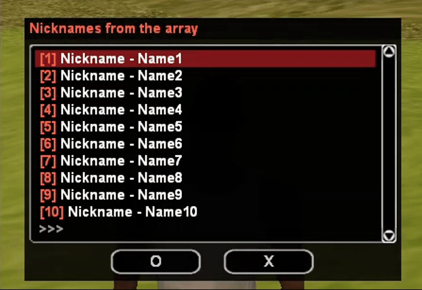
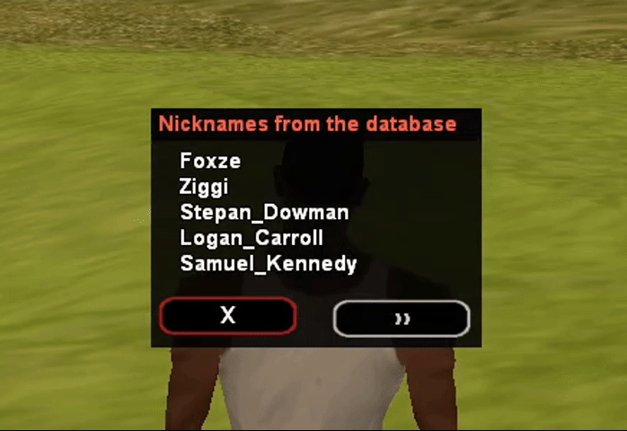
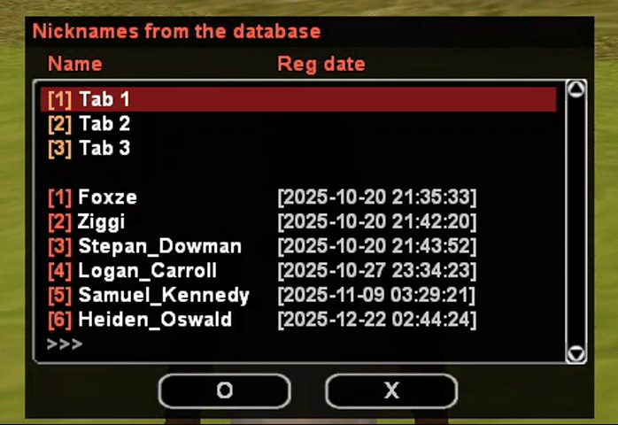

# mdialog
Modern dialog system.

# Functions
#### Open dialog
```Pawn
Dialog_Open(playerid, const function[], style, const caption[], const info[], const button1[], const button2[]);
```

#### Close dialog
```Pawn
Dialog_Close(playerid, const function[] = "", showDialog = true);
```

#### Get name of the current dialog
```Pawn
Dialog_GetCurrent(playerid, function[], const size = sizeof(function))
```

#### Check on opening dialog by name or any (if function is empty)
```Pawn
Dialog_IsOpen(playerid, const function[] = "");
```

#### Show dialog by name
```Pawn
Dialog_Show(playerid, const function[]);
```

#### Show message dialog
```Pawn
Dialog_Message(playerid, const caption[], const info[], const button1[]);
```

#### Show message dialog with custom response callback
```Pawn
Dialog_MessageEx(playerid, const response[], const caption[], const info[], const button1[], const button2[]);
```

# [zlang](https://github.com/Open-GTO/zlang) support
If MDIALOG_ZLANG_MODE is defined then some mdialog functions take a new view.

#### Open dialog
```Pawn
Dialog_Open(playerid, const function[], style, const caption[], const info[], const button1[], const button2[], {Float, _}:...);
```

#### Show message dialog
```Pawn
Dialog_Message(playerid, const caption[], const info[], const button1[], {Float, _}:...);
```

#### Show message dialog with custom response callback
```Pawn
Dialog_MessageEx(playerid, const response[], const caption[], const info[], const button1[], const button2[], {Float, _}:...);
```

# Tags support
You can use tags for markup your dialogs:

Tag | Description
----|-----------
\\\c | Centers the text
\\\r | Aligns the text to the right


You also can disable tags with definition of `MDIALOG_DISABLE_TAGS` before `mdialog` including. This can be useful if you are not interested in this feature and wants a little bit more performance.

# Usage
You can use `DialogCreate:`, `DialogResponse:` and `DialogInterrupt:` prefixes:
```Pawn
DialogCreate:test(playerid)
{
	Dialog_Open(playerid, Dialog:test, DIALOG_STYLE_MSGBOX,
	            "Hello",
	            "Are you ok?",
	            "Yes", "No");
}

DialogResponse:test(playerid, response, listitem, inputtext[])
{
	if (!response) {
		SendClientMessage(playerid, -1, "This club only for OK guys!");
		Dialog_Show(playerid, Dialog:test);
		return 1;
	}

	SendClientMessage(playerid, -1, "Welcome to the club");
	return 1;
}

DialogInterrupt:test(playerid)
{
	SendClientMessage(playerid, -1, "Dialog \"test\" was closed by Dialog_Close or by opening other dialog");
	return 1;
}
```

# Usage with zlang mode
```Pawn
#define MDIALOG_ZLANG_MODE
#include "mdialog"

DialogCreate:test(playerid)
{
	Dialog_Open(playerid, Dialog:test, DIALOG_STYLE_MSGBOX,
	            "Hello",
	            "LANG_ARE_YOU_OK",
	            "Yes", "BUTTON_NO",
	            playerid);
}

DialogResponse:test(playerid, response, listitem, inputtext[])
{
	if (!response) {
		SendClientMessage(playerid, -1, "This club only for OK guys!");
		Dialog_Show(playerid, Dialog:test);
		return 1;
	}

	SendClientMessage(playerid, -1, "Welcome to the club");
	return 1;
}
```

Lang file:
```
LANG_ARE_YOU_OK = Hey id %d, are you ok?
BUTTON_NO = No
```

# Pagination
Dialog pagination is available. You can implement simple and complex pagination, as well as query the database and receive responses directly during dialog creation. `zlang` is supported.

Supported dialog styles: `DIALOG_STYLE_MSGBOX`, `DIALOG_STYLE_LIST`, `DIALOG_STYLE_TABLIST`, `DIALOG_STYLE_TABLIST_HEADERS`.

## Functions
#### Dialog initialization. Should be in `DialogInit:`
```Pawn
DialogPagin_Init(playerid, max_lines_on_page);
```

#### Setting up a database query. Should be in `DialogInit:`
```Pawn
DialogPagin_SetQuery(playerid, MySQL:handle, const query[], const length = sizeof(query), {Float, _}:...);
```

#### Open pagination dialog
```Pawn
DialogPagin_Open(playerid, const caption[], {Float, _}:...);
```

#### Adding a line
```Pawn
DialogPagin_AddLine(playerid, color, const text[], {Float, _}:...);
```

#### Adding a static line
```Pawn
DialogPagin_AddStaticLine(playerid, color, const text[], {Float, _}:...);
```

#### Adding tablist
```Pawn
DialogPagin_AddTablist(playerid, const text[], {Float, _}:...);
```

#### Adding color
```Pawn
DialogPagin_AddColor(playerid, const color[]);
```

#### Saving your abstract ID for the line
```Pawn
DialogPagin_SaveLineID(playerid, abstractid);
```

#### Keeping your abstract name for the line
```Pawn
DialogPagin_SaveLineName(playerid, const abstract_name[]);
```

#### Get an abstract ID after the player selects a line
```Pawn
DialogPagin_GetSelectLineID(playerid);
```

#### Get an abstract name after the player selects a line
```Pawn
DialogPagin_GetSelectLineName(playerid, output[], const size = sizeof(output));
```

#### Checking for the first page
```Pawn
DialogPagin_IsFirstPage(playerid);
```

#### Checking for the last page
```Pawn
DialogPagin_IsLastPage(playerid);
```

#### Get the total number of lines
```Pawn
DialogPagin_GetTotalItems(playerid);
```

#### Checking if a new line needs to be added
```Pawn
DialogPagin_IsValidLine(playerid);
```

## Default usage
```Pawn
new nicknames[][MAX_PLAYER_NAME + 1] = 
	{
		"Name1", "Name2", "Name3", "Name4", "Name5",
		"Name6", "Name7", "Name8", "Name9", "Name10",
		"Name11", "Name12", "Name13", "Name14", "Name15",
		"Name16", "Name17", "Name18", "Name19", "Name20",
		"Name21", "Name22"
	};

DialogInit:TestDialog(playerid)
{
	// Initializing and setting the maximum number of lines on the page to 10
	DialogPagin_Init(playerid, 10);
	return 1;
}

DialogCreate:TestDialog(playerid)
{
	for (new i; i < sizeof(nicknames); i++) {
		DialogPagin_AddLine(playerid, 0xFF6347FF, // 0x00000000 - removes the numbering
			"{FFFFFF}Nickname - %s",
			nicknames[i]);
	}

	DialogPagin_Open(playerid, Dialog:TestDialog, DIALOG_STYLE_LIST,
		"{FF6347}Nicknames from the array");

	return 1;
}

DialogResponse:TestDialog(playerid, response, listitem, inputtext[])
{
	if (!response) {
		// Your code...
		return 1;	
	}

	// Your code...
	return 1;
}
```


## MySQL usage
```Pawn
DialogInit:TestDialog(playerid)
{
	DialogPagin_Init(playerid, 5);

	// Loading all player nicknames
	// Note: the `total_count` field is required!
	// The total number of fields to be uploaded is required
	DialogPagin_SetQuery(playerid, MySQL:db,
		"SELECT \
    		`nickname`, \
   			(SELECT COUNT(*) FROM `player_accounts`) as `total_count` \
		FROM `player_accounts` \
		ORDER BY `id` ASC");

	return 1;
}

DialogCreate:TestDialog(playerid)
{
	new
		playerName[MAX_PLAYER_NAME + 1];

	for (new i; i < cache_num_rows(); i++) {
		cache_get_value(i, "nickname", playerName);

		DialogPagin_AddLine(playerid,
			0x00000000,
			"{FFFFFF}%s",
			playerName);
	}

	DialogPagin_Open(playerid, Dialog:TestDialog, DIALOG_STYLE_MSGBOX,
		"{FF6347}Nicknames from the database");

	return 1;
}

DialogResponse:TestDialog(playerid, response, listitem, inputtext[])
{
	if (!response) {
		// Your code...
		return 1;	
	}

	// Your code...
	return 1;
}
```


## Professional usage
```Pawn
DialogInit:TestDialog(playerid)
{
	DialogPagin_Init(playerid, 6);

	// Loading all player nicknames
	DialogPagin_SetQuery(playerid, MySQL:db,
		"SELECT \
    		`nickname`, \
			`reg_datetime`, \
   			(SELECT COUNT(*) FROM `player_accounts`) as `total_count` \
		FROM `player_accounts` \
		ORDER BY `id` ASC");

	return 1;
}

DialogCreate:TestDialog(playerid)
{
	new
		playerName[MAX_PLAYER_NAME + 1],
		datetime[20];

	DialogPagin_AddStaticLine(playerid, 0xFFAC55FF,
		"{FFFFFF}Tab 1");

	DialogPagin_AddStaticLine(playerid, 0xFFAC55FF,
		"{FFFFFF}Tab 2");

	DialogPagin_AddStaticLine(playerid, 0xFFAC55FF,
		"{FFFFFF}Tab 3");

	DialogPagin_AddTablist(playerid, "{FF6347}Name\t{FF6347}Reg date");

	for (new i; i < cache_num_rows(); i++) {
		cache_get_value(i, "nickname", playerName);
		cache_get_value(i, "reg_datetime", datetime);

		DialogPagin_AddLine(playerid,
			0xFF6347FF,
			"{FFFFFF}%s\t{CCCCCC}[%s]",
			playerName, datetime);

		// Saving the player's nickname
		DialogPagin_SaveLineName(playerid,
			playerName);
	}

	DialogPagin_Open(playerid, Dialog:TestDialog, DIALOG_STYLE_TABLIST_HEADERS,
		"{FF6347}Nicknames from the database");

	return 1;
}

DialogResponse:TestDialog(playerid, response, listitem, inputtext[])
{
	if (!response) {
		// Your code...
		return 1;	
	}

	// For static lines
	if (DialogPagin_IsFirstPage(playerid)) {
		switch (listitem) {
			case 0: {
				SendClientMessage(playerid, 0xFFFFFFFF, "Tab 1");
				return 1;
			}
			case 1: {
				SendClientMessage(playerid, 0xFFFFFFFF, "Tab 2");
				return 1;
			}
			case 2: {
				SendClientMessage(playerid, 0xFFFFFFFF, "Tab 3");
				return 1;
			}
		}
	}

	new
		playerName[MAX_PLAYER_NAME + 1];

	// We get the nickname that the player chose
	DialogPagin_GetSelectLineName(playerid, playerName);

	// Your code...
	return 1;
}
```

